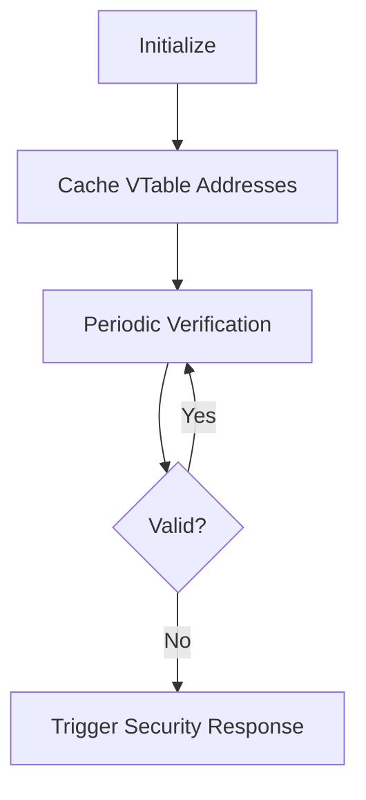
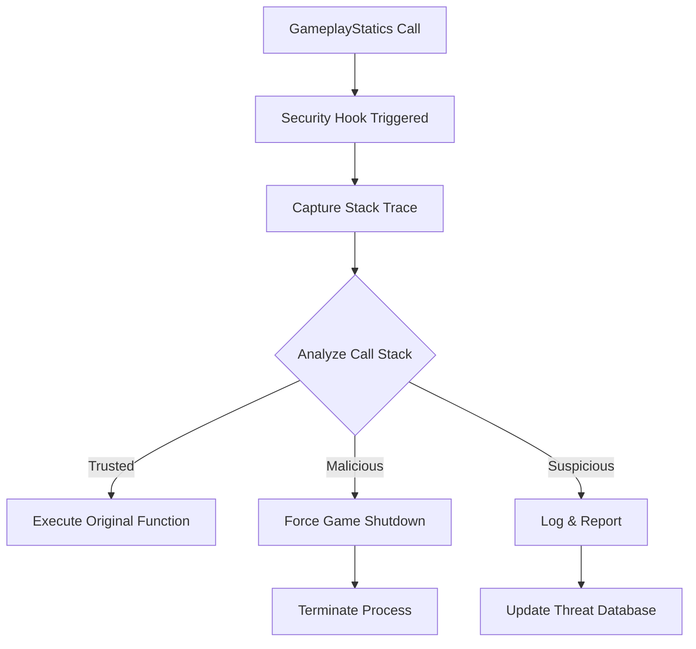
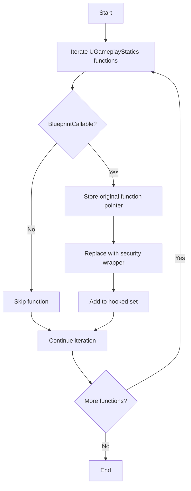
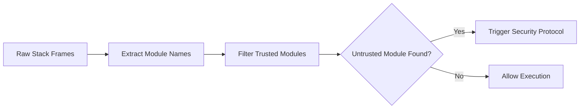
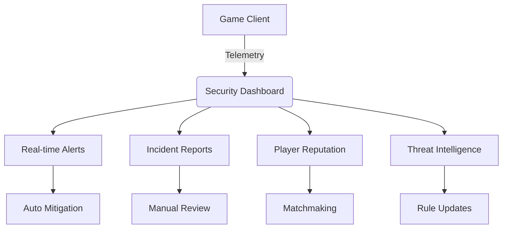
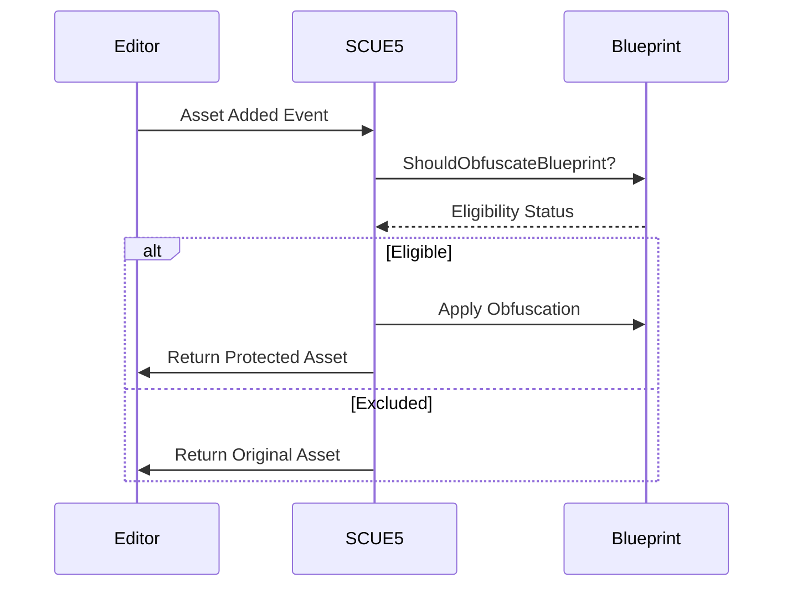
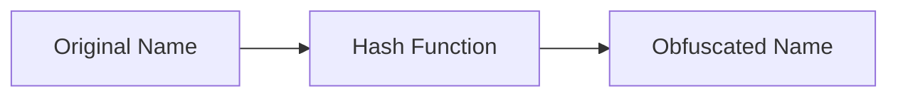
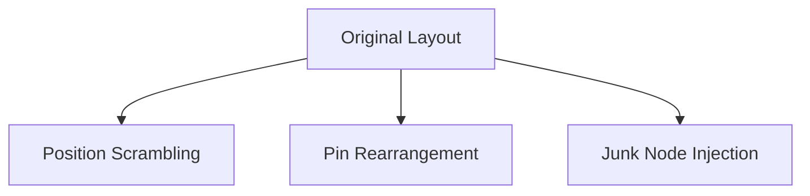
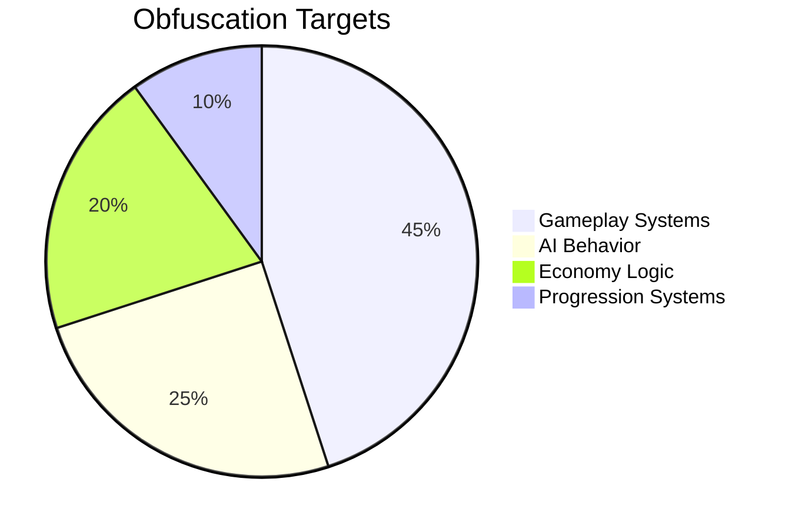

# 🔐 Secure-Client UE5 Plugin

**Secure-Client** is a lightweight, encryption-based anti-cheat plugin for **Unreal Engine 5**. It introduces secure memory containers for primitive types and adds process keyword detection for intuitive runtime cheat prevention and anti-tampering.

Europe-Compliant Anti-Cheat - Advanced protection without kernel spies. Stop memory hackers while respecting player privacy.

This implementation provides **military-grade** protection for data values while maintaining full property manipulation capabilities.
The security features include hardware-enforced memory protection, automatic key rotation, compression for large strings, and comprehensive tamper detection, making it suitable for sensitive game data like player names, authentication tokens, steam ids, save data, and configuration files.

Ideal for protecting sensitive in-game values like player stats, currency, micro-transactions, and online game states.

---

## 🧩 Table of Contents

1.  [Overview](#features)
2.  [Plugin Settings](#scue5-settings)
3.  [Encrypted Types](#secure-variable-types)
4.  [Code Samples](#usage-examples)
5.  [Enhanced Cheat Detection System](#enhanced-cheat-detection-system)
6.  [Runtime Stack Capture System](#runtime-stack-capture-system)
7.  [Behavioral Analysis](#behavioral-analysis-system)
8.  [Blueprint Obfuscation](#scue5-blueprint-obfuscation)
9.  [Unit Test Module](#scue5-unit-test-module)
10. [PE Signature Tool](#pe-signature-extraction-tool)
11. [EULA](#scue5-eula)

---

## Features

- 🔐 Encrypted variable wrappers for Bool, Int, Float, String, and more
- 🧠 Dual-buffer encoding and memory shifting for obfuscation
- 🔑 Supports global and custom encryption keys
- 🧾 SaveGame serialization support for all secure types
- 🧪 Blueprint-compatible: use secure types in visual scripting
- 🕵️ Built-in keyword-based process detection (Windows only)
- 🛡️ Designed for basic anti-cheat and anti-tamper hardening

---

### SCUE5 Settings

Editable via **Project Settings → Plugins → Secure-Client**.

| Property | Description |
|----------|-------------|
| `KeyGeneratorPath` | Path to optional external key generator |
| `IllegalKeywords`  | List of suspicious process names for detection |
| `IllegalProcessNames` | List of suspicious process names for detection |
| `CheatSignatures` | List of signatures for pre-identified cheating software |

---

## Secure Variable Types

Each secure type stores encrypted values internally using **Base/Shift containers**. Switching occurs on access to make memory tracing harder.

| Type          | Description                    |
|---------------|--------------------------------|
| `FSafeBool`   | Secure boolean value           |
| `FSafeByte`   | Encrypted uint8                |
| `FSafeInt`    | Encrypted int32 with operators |
| `FSafeFloat`  | Encrypted float                |
| `FSafeName`   | Secure `FName`                 |
| `FSafeString` | Encrypted `FString`            |
| `FSafeText`   | Encrypted `FText`              |
| `FSafeVector2D` → `Vector4D` | Encrypted vectors |
| `FSafeColor`  | Secure `FLinearColor`          |

### Common Methods

```cpp
.SetValue(Input);        // Set secure value
.GetValue();             // Decrypt and retrieve value
.GetValue("CustomKey");  // Use custom encryption key
```

### Example

```cpp
FSafeInt Health(100);
Health += 25;

int32 RealHealth = Health.GetValue();
```

---

## 🧪 Blueprint Integration

All `FSafe*` types are available in Blueprints:

- Create and assign secure variables in Blueprint Classes
- Use `GetValue`, `SetValue` nodes
- Ideal for gameplay logic without C++

---

## 🔐 Custom Key Encryption

Every secure type supports a custom key-based encoding scheme.

```cpp
FSafeFloat Speed("MySecretKey", 600.0f);
float RealSpeed = Speed.GetValue("MySecretKey");
```

Use different keys per variable or group for added obfuscation.

---

## 🧠 Process Keyword Detection (Windows)

To detect suspicious software at runtime:

1. Add known keywords to `IllegalKeywords` in project settings.
2. Call detection manually:

```cpp
#if PLATFORM_WINDOWS
  FSCUE5_Enumerate();
#endif
```

Scans current processes for any name that matches the provided list.

---

## 📜 Internal Encoding System

1. For basic obfuscation:

```cpp
FString Obfuscated = FEncode(OriginalString);
FString Recovered = FDecode(Obfuscated);
```

2. For sensitive data:

```cpp
FString Encrypted = SecureEncode(OriginalString, "SecretKey");
FString Decrypted = SecureDecode(Encrypted, "SecretKey");
```

3. For high-security scenarios:

```cpp
// Rotating keys based on session
FString SessionKey = GenerateCipherKey(FDateTime::Now().ToString());
FString SecureData = SecureEncode(SensitiveData, SessionKey);

// Verify before use
if (ValidateCipherText(SecureData)) {
    FString Result = SecureDecode(SecureData, SessionKey);
}
```

---

## Usage Examples

> Safe Integer
```cpp
/* :: Secured Numeral :: */
// Initialize security system (once per application)
FSafeInt::InitSecuritySystem(TEXT("GlobalSecretKey123"));

// Create secure integers
FSafeInt PlayerScore = 0;
FSafeInt BonusPoints = 500;

// Arithmetic operations
PlayerScore += 100;
PlayerScore *= 2;
PlayerScore += BonusPoints;

// Comparison
if (PlayerScore > 1000) {
    UnlockAchievement();
}

// Critical section
PlayerScore.LockArithmetic();
ProcessHighScore();
PlayerScore.UnlockArithmetic();

// Memory protection
PlayerScore.LockMemory();
```

> Safe String
```cpp
/* :: Secured Strings :: */
// Initialize security system (once per application)
FSafeString::InitSecuritySystem(TEXT("GlobalSecretKey123"));

// Create secure strings
FSafeString PlayerName = TEXT("JohnDoe");
FSafeString SecretToken = TEXT("eyJhbGciOiJIUzI1NiIsInR5cCI6IkpXVCJ9...");

// Enable compression for large strings
SecretToken.EnableCompression();

// String operations
PlayerName += TEXT("_Player1");
FString FullName = PlayerName + TEXT(" - VIP");

// Comparison
if (PlayerName == TEXT("JohnDoe_Player1")) {
    GrantVIPAccess();
}

// Memory protection
SecretToken.LockMemory();

// Serialization
FArchive& Ar = ...;
Ar << PlayerName; // Securely serializes
```

> Safe Text
```cpp
/* :: Secured Texts :: */
// Initialize security system (once per application)
FSafeText::InitSecuritySystem(TEXT("GlobalSecretKey123"));

// Create secure texts
FSafeText WelcomeMessage = FText::FromString(TEXT("Welcome to the game!"));
FSafeText LocalizedDialog = NSLOCTEXT("GameDialogs", "Intro", "Welcome {PlayerName}!");

// Enable compression for localized text
LocalizedDialog.EnableCompression();

// Format text with arguments
FFormatNamedArguments Args;
Args.Add(TEXT("PlayerName"), FText::FromString("John"));
FText Formatted = FText::Format(LocalizedDialog.GetValue(), Args);

// Comparison
if (WelcomeMessage.GetValue().EqualTo(FText::FromString("Welcome to the game!"))) {
    ShowWelcomeMessage();
}

// Memory protection
WelcomeMessage.LockMemory();
```

> Safe Vector
```cpp
// Initialize security system (once per application)
FSafeVector3D::InitSecuritySystem(TEXT("GlobalSecretKey123"));

// Create secure vectors
FSafeVector3D PlayerPosition = FVector(100.0f, 200.0f, 300.0f);
FSafeVector3D Gravity = FVector(0.0f, 0.0f, -980.0f);

// Vector operations
PlayerPosition += Gravity * DeltaTime;

// Component access
float Height = PlayerPosition.GetZ();
PlayerPosition.SetY(PlayerPosition.GetY() + 5.0f);

// Critical section - lock components
PlayerPosition.LockComponents();
ProcessPhysics();
PlayerPosition.UnlockComponents();

// Comparison
if (PlayerPosition == FVector(100.0f, 205.0f, 250.0f)) {
    TriggerLanding();
}

// Memory protection
PlayerPosition.LockMemory();
```

> Safe Vector 2D
```cpp
/* :: Secured Vectors :: */
// Initialize security system (once per application)
FSafeVector2D::InitSecuritySystem(TEXT("GlobalSecretKey123"));

// Create secure vectors
FSafeVector2D PlayerPosition = FVector2D(100.0f, 200.0f);
FSafeVector2D MovementDirection = FVector2D(1.0f, 0.5f);

// Vector operations
PlayerPosition += MovementDirection * 10.0f;

// Component access
float X = PlayerPosition.GetX();
PlayerPosition.SetY(PlayerPosition.GetY() + 5.0f);

// Critical section - lock components
PlayerPosition.LockComponents();
ProcessCollision();
PlayerPosition.UnlockComponents();

// Comparison
if (PlayerPosition == FVector2D(110.0f, 210.0f)) {
    TriggerCheckpoint();
}

// Memory protection
PlayerPosition.LockMemory();
```

## ⚠️ Best Practices

| ✅ Do | ❌ Avoid |
|------|----------|
| Secure critical values (health, currency, ammo) | Relying on this as full anti-cheat |
| Rotate encryption keys periodically | Storing hardcoded secrets in memory |
| Combine with server validation | Expecting to block all attacks |

> This system adds **significant hardening**, not **infallibility**.

---

## 🔍 Debug Tips

| Problem | Solution |
|--------|----------|
| `.GetValue()` returns wrong value | Check key consistency |
| Doesn't appear in Blueprint | Recompile & restart UE5 |
| Process detection fails | Check platform (Windows only) |

---

## 🧱 Serialization Support

All secure structs implement `FArchive` overloads and `SaveGame` compatibility. Use in saved games and replicated state.

---

# Enhanced Cheat Detection System

## Overview (Windows-Only System)
The SCUE5 system provides a multi-layered approach to cheat detection and prevention in Unreal Engine 5 projects. This enhanced implementation combines four complementary security mechanisms to detect and respond to cheating attempts in real-time.

## Key Features
1. **VTable Integrity Verification**  
   Monitors critical class virtual tables for unexpected modifications
2. **Memory Signature Scanning**  
   Detects known cheat patterns in game memory
3. **Process/Window Enumeration**  
   Identifies running cheat software by name and window title
4. **Memory Canary System**  
   Detects unexpected memory modifications in critical game structures

## Installation
1. Add the SCUE5 plugin to your project's `Plugins/` directory
2. Add to your `ProjectName.Build.cs`:
   ```csharp
   PublicDependencyModuleNames.AddRange(new string[] { 
       "SCUE5" 
   });
   ```
3. Enable the plugin in your project settings

## Configuration
Configure detection parameters in `DefaultSCUE5.ini`:

```ini
[SCUE5_Settings]
; Process names to detect (exact match)
IllegalProcessNames="cheatengine-x86_64.exe"
IllegalProcessNames="artmoney.exe"
IllegalProcessNames="wpepro.exe"

; Keywords for window/process detection
IllegalKeywords="cheat"
IllegalKeywords="trainer"
IllegalKeywords="debugger"

; Memory signatures (hex patterns)
CheatSignatures=90 90 90
CheatSignatures=E9 00 00 00 00
```

## Usage
### Basic Implementation
Add to your GameInstance subclass header:
```cpp
#include "SCUE5.h"

UCLASS()
class YOURPROJECT_API UYourGameInstance : public UGameInstance
{
    GENERATED_BODY()
    
    virtual void Init() override;
    virtual void Shutdown() override;

    UPROPERTY()
    USafeGameInstanceSubsystem* SecuritySubsystem;
};
```

Implement in your GameInstance:
```cpp
void UYourGameInstance::Init()
{
    Super::Init();
    
    // Initialize security subsystem
    SecuritySubsystem = GetSubsystem<USafeGameInstanceSubsystem>();
}

void UYourGameInstance::Shutdown()
{
    // Clean up security system
    if(SecuritySubsystem) SecuritySubsystem = nullptr;
    
    Super::Shutdown();
}
```

### Advanced Usage
```cpp
// Manually trigger security scan
SecuritySubsystem->RunSecurityScan();

// Add custom detection patterns at runtime
USCUE5Settings* Settings = GetMutableDefault<USCUE5Settings>();
Settings->IllegalKeywords.AddUnique("mycheat");
Settings->CheatSignatures.Add({0xAA, 0xBB, 0xCC});

// Add custom memory regions to protect
SecuritySubsystem->AddProtectedRegion(
    TEXT("CustomComponent"), 
    0xDEADBEEF, 
    0xCAFEBABE
);
```

## Detection Mechanisms

### 1. VTable Integrity Checks


Verifies critical class VTables including:
- `AActor`
- `APlayerController`
- `UGameInstance`
- `USafeGameInstanceSubsystem`

### 2. Memory Signature Scanning
Scans for patterns like:
```cpp
// NOP sled
{0x90, 0x90, 0x90}

// Jump instruction
{0xE9, 0x00, 0x00, 0x00, 0x00}

// RET + NOP
{0xC3, 0x90}
```

### 3. Process/Window Detection
Detects 50+ known cheat tools including:
- Cheat Engine
- ArtMoney
- OllyDbg
- x64dbg
- Process Hacker
- Memory editors

### 4. Memory Canaries
Configuration example:
```cpp
CriticalRegions.Add({
    TEXT("PlayerState"), 
    0xDEADBEEF,  // Start marker
    0xCAFEBABE   // End marker
});
```

## Customization

### Adding New Detections
**New memory signatures:**
```cpp
GetMutableDefault<USCUE5Settings>()
    ->CheatSignatures
    .Add({0x12, 0x34, 0x56});
```

**New process names:**
```cpp
GetMutableDefault<USCUE5Settings>()
    ->IllegalProcessNames
    .Add(TEXT("new_cheat_tool.exe"));
```

**New protected memory regions:**
```cpp
SecuritySubsystem->AddProtectedRegion(
    TEXT("CustomComponent"), 
    0x11223344, 
    0x55667788
);
```

### Adjusting Scan Frequency
```cpp
// In USafeGameInstanceSubsystem::Initialize
GetGameInstance()->GetTimerManager().SetTimer(
    SecurityTimerHandle,
    SecurityDelegate,
    NewInterval,  // Set custom interval
    true
);
```

## Building the System
1. Compile the plugin with your project
2. For standalone security module:
```bash
# Build Key Generator
cd Source/ThirdParty
cl SCUE5_Key-Generator.cpp /EHsc /Fe:SCUE5_Key-Generator.exe
```

## Limitations
1. Windows-only implementation
2. Requires shipping builds for full protection
3. Memory scanning may impact performance on large games
4. Cannot detect kernel-level cheats

## Support
For assistance with implementation:
- Email: hokkaido.hideout@gmail.com
- Discord: [Support Server](https://discord.gg/BzTRUqPEAF)
- Issue Tracker: [Report Issues](https://github.com/Hokkaido-Hideout/SecureClientPlugin/issues)

## License
This system is licensed under the Unreal Engine EULA.
Commercial use requires proper attribution.

---

# Runtime Stack Capture System

## Overview
This system provides runtime security monitoring for critical Unreal Engine functions by capturing call stacks, analyzing their origins, and shutting down the game when malicious activity is detected. It specifically targets vulnerable entry points like `UGameplayStatics` that are common attack vectors in Unreal Engine games.



## Key Features
- **Runtime stack tracing** for calls to engine functions
- **Module origin verification** for each stack frame
- **Memory integrity checks** against known-good hashes
- **Behavioral analysis** of call patterns
- **Emergency shutdown** protocol for security violations

## Implementation Guide

### 1. Function Hooking System

#### Hook Installation
```cpp
void InstallSecurityHook(UClass* TargetClass, FName FunctionName)
{
    if(UFunction* TargetFunc = TargetClass->FindFunctionByName(FunctionName))
    {
        // Store original function pointer
        OriginalFunctions.Add(FunctionName, TargetFunc->GetNativeFunc());
        
        // Replace with security wrapper
        TargetFunc->SetNativeFunc((FNativeFunctionPtr)&SecurityHookWrapper);
    }
}
```

#### Hook Wrapper Template
```cpp
template<typename... TArgs>
auto SecurityHookWrapper(UObject* Context, FFrame& Stack, RESULT_DECL, TArgs... Args)
{
    // Capture stack trace
    TArray<void*> StackFrames;
    CaptureStackTrace(StackFrames);
    
    // Security analysis
    if(AnalyzeCallStack(StackFrames))
    {
        SecurityShutdown(TEXT("Malicious call detected"));
        return;
    }
    
    // Execute original function
    auto OriginalFunc = OriginalFunctions.Find(FunctionName);
    OriginalFunc(Context, Stack, RESULT_PARAM, Args...);
}
```

### 2. Stack Capture Implementation

#### Windows Stack Capture
```cpp
void CaptureStackTrace(TArray<void*>& OutFrames, int32 MaxFrames = 62)
{
    OutFrames.Empty(MaxFrames);
    
    CONTEXT ContextRecord;
    RtlCaptureContext(&ContextRecord);
    
    STACKFRAME64 StackFrame;
    ZeroMemory(&StackFrame, sizeof(STACKFRAME64));
    
    DWORD MachineType = IMAGE_FILE_MACHINE_AMD64;
    StackFrame.AddrPC.Offset = ContextRecord.Rip;
    StackFrame.AddrPC.Mode = AddrModeFlat;
    
    while(::StackWalk64(MachineType, 
                       GetCurrentProcess(),
                       GetCurrentThread(),
                       &StackFrame,
                       &ContextRecord,
                       NULL,
                       ::SymFunctionTableAccess64,
                       ::SymGetModuleBase64,
                       NULL) && OutFrames.Num() < MaxFrames)
    {
        OutFrames.Add((void*)StackFrame.AddrPC.Offset);
    }
}
```

#### Cross-Platform Fallback
```cpp
void CaptureStackTraceFallback(TArray<void*>& OutFrames)
{
    const int32 MaxFrames = 128;
    void* StackFrames[MaxFrames];
    int32 Frames = FPlatformStackWalk::CaptureStackBackTrace(
        StackFrames, MaxFrames
    );
    OutFrames.Append(StackFrames, Frames);
}
```

### 3. Security Analysis Pipeline

#### Analysis Workflow
```cpp
bool AnalyzeCallStack(const TArray<void*>& StackFrames)
{
    // Module origin check
    if(!VerifyModuleOrigins(StackFrames)) 
        return true;
    
    // Memory integrity check
    if(!VerifyMemoryIntegrity(StackFrames)) 
        return true;
    
    // Behavioral analysis
    if(DetectAnomalousPatterns(StackFrames)) 
        return true;
    
    // Thread context verification
    if(!IsValidThreadContext()) 
        return true;
    
    return false;
}
```

#### Module Verification
```cpp
bool VerifyModuleOrigins(const TArray<void*>& StackFrames)
{
    static const TSet<FString> TrustedModules = {
        TEXT("MyGame.exe"),
        TEXT("UnrealEngine-Core.dll")
    };
    
    for(void* Address : StackFrames)
    {
        FString ModuleName = FPlatformProcess::GetModuleName(Address);
        
        if(!TrustedModules.Contains(ModuleName) && 
           !IsValidCodeCave(Address) && 
           !IsKnownSafePlugin(ModuleName))
        {
            LogSecurityEvent(TEXT("Untrusted module: ") + ModuleName);
            return false;
        }
    }
    return true;
}
```

### 4. Security Responses

#### Emergency Shutdown
```cpp
void SecurityShutdown(const FString& Reason)
{
    // Critical: Execute in guarded memory
    {
        // Log to secure channel
        //LogToSecureServer(Reason);
        
        // Immediate termination
        FPlatformMisc::RequestExit(true, *Reason);
        
        // Nuclear option
        //TerminateProcess(GetCurrentProcess(), 0xDEAD);
    }
}
```

#### Suspicious Activity Response
```cpp
void HandleSuspiciousActivity(const TArray<void*>& StackFrames)
{
    // Throttle responses to prevent DoS
    static FDateTime LastResponse = FDateTime::MinValue();
    if((FDateTime::Now() - LastResponse).GetSeconds() < 5) return;
    
    // Capture forensic data
    FSecurityEvent EventData;
    EventData.StackTrace = StackFrames;
    EventData.MemorySnapshot = CaptureMemoryRegions();
    EventData.ThreadContext = CaptureThreadState();
    
    // Submit to security server
    SubmitForensicData(EventData);
    
    // Optional: Disable vulnerable features
    if(IsCriticalVulnerability())
        DisableGameFeature(EFeatureFlags::OnlineServices);
    
    LastResponse = FDateTime::Now();
}
```

## Configuration Settings

### Security.ini
```ini
[SecuritySettings]
; Enable security hooks
bEnableRuntimeProtection=true

; Modules considered safe
TrustedModules=MyGame.exe, UE5-Core.dll, GameModule.dll

; Response configuration
ShutdownThreshold=3
MemoryScanInterval=30.0
BehavioralSampleRate=0.1
```

## Threat Detection Matrix

| Threat Type | Detection Method | Response |
|-------------|------------------|----------|
| **DLL Injection** | Untrusted module in call stack | Immediate shutdown |
| **Code Cave Execution** | Address outside module boundaries | Shutdown + forensic capture |
| **Function Hooking** | Memory checksum mismatch | Feature disablement |
| **Call Flooding** | Frequency threshold exceeded | Temporary lockout |
| **Thread Hijacking** | Invalid thread context | Thread termination |
| **Return Address Spoofing** | Stack frame inconsistency | Stack validation failure |

## Integration Guide

### Initialization Sequence
1. **Pre-engine initialization**: Load security configs
2. **Post-engine init**: Install function hooks
3. **Begin play**: Start monitoring threads
4. **Runtime**: Periodic security scans
5. **Shutdown**: Secure telemetry upload

### Recommended Hook Points
```cpp
// GameInstance.cpp
void UMyGameInstance::OnStart()
{
    Super::OnStart();
    
    FSecuritySystem::Get().Initialize();
    
    // Critical hooks
    InstallSecurityHook(UGameplayStatics::StaticClass(), "OpenLevel");
    InstallSecurityHook(UGameplayStatics::StaticClass(), "ExecuteConsoleCommand");
    InstallSecurityHook(UGameplayStatics::StaticClass(), "SpawnObject");
    InstallSecurityHook(UGameplayStatics::StaticClass(), "LoadAsset");
}
```

## Limitations and Mitigations

| Limitation | Mitigation Strategy |
|------------|---------------------|
| Performance overhead | Sampling mode for non-critical functions |
| False positives | Extensive allow-listing + machine learning |
| Kernel-level attacks | Integration with anti-cheat services |
| Reverse engineering | Code obfuscation + integrity checks |
| Hook detection | Polymorphic hook installation |
| Memory scanning evasion | Multiple scan techniques + entropy analysis |

## Best Practices
1. **Combine with server-side validation** for critical actions
2. **Use encrypted communications** for security telemetry
3. **Implement gradual responses** before full shutdown
4. **Regularly update trusted modules** list
5. **Obfuscate security system entry points**
6. **Perform monthly penetration testing**
7. **Maintain allow/block lists** in cloud-configurable storage

> **Warning**: This system should be part of a multi-layered security strategy. Always combine with commercial anti-cheat solutions for production games.

---

# Understanding Runtime Hooks

Runtime hooks intercept function calls at execution time, allowing you to:
1. Inspect call parameters and context
2. Modify behavior before/after execution
3. Add security checks and monitoring
4. Capture execution context (stack traces, threads, etc.)

In Unreal Engine, we hook `UFunction`s by replacing their native function pointers while preserving original functionality.

## Implementation: Hooking BlueprintCallable Functions in UGameplayStatics

### SecuritySystem.cpp
```cpp
void FSecuritySystem::InstallHooks()
{
    UClass* GameplayStaticsClass = UGameplayStatics::StaticClass();
    
    // Iterate through all functions in UGameplayStatics
    for(TFieldIterator<UFunction> FuncIt(GameplayStaticsClass, EFieldIteratorFlags::IncludeSuper); FuncIt; ++FuncIt)
    {
        UFunction* Function = *FuncIt;
        
        // Hook only BlueprintCallable functions
        if(Function->HasAnyFunctionFlags(FUNC_BlueprintCallable))
        {
            InstallHook(Function);
        }
    }
}
```

## Integration

### GameInstance.cpp
```cpp
#include "SecuritySystem.h"

void UMyGameInstance::OnStart()
{
    Super::OnStart();
    
    // Initialize security system
    FSecuritySystem::Initialize();
}

void UMyGameInstance::Shutdown()
{
    FSecuritySystem::Shutdown();
    Super::Shutdown();
}
```

## Key Components

### 1. Function Hook Installation


### 2. Hook Execution Flow
```cpp
void SecurityHookWrapper(...)
{
    // 1. Capture stack trace immediately
    // 2. Analyze stack for untrusted modules
    // 3. If suspicious: emergency shutdown
    // 4. If clean: execute original function
}
```

### 3. Stack Analysis


## Advanced Techniques

### Dynamic Trust Management
```cpp
void UpdateTrustedModules()
{
    TArray<FString> NewTrusted;
    
    // 1. Check code signatures
    for(auto& Module : LoadedModules)
    {
        if(VerifyDigitalSignature(Module))
            NewTrusted.Add(Module);
    }
    
    // 2. Add whitelisted plugins
    NewTrusted.Append(GetApprovedPlugins());
    
    // 3. Update security system
    FSecuritySystem::UpdateTrustedModules(NewTrusted);
}
```

### Performance Optimization
```cpp
// Rate-limited stack capture
static FDateTime LastCapture;

void SecurityHookWrapper(...)
{
    if((FDateTime::Now() - LastCapture).GetSeconds() < Config.StackCaptureFrequency)
    {
        // Skip security check this time
        CallOriginalFunction();
        return;
    }
    
    // Full security check
    LastCapture = FDateTime::Now();
    // ... rest of security checks ...
}
```

## Security Considerations



1. **Hook Protection**: 
   - Encrypt function pointers
   - Validate hook integrity periodically
   - Use guard pages around critical functions

2. **Anti-Tampering**:
   ```cpp
   void ValidateHooks()
   {
       for(auto& Elem : OriginalFunctions)
       {
           UFunction* Func = UGameplayStatics::StaticClass()->FindFunctionByName(Elem.Key);
           if(Func->GetNativeFunc() != &SecurityHookWrapper)
           {
               // Hook tampering detected!
               EmergencyShutdown();
           }
       }
   }
   ```

3. **Stealth Techniques**:
   - Randomize hook installation order
   - Use JMP trampolines instead of direct replacements
   - Hide security module from process enumeration

## Limitations and Workarounds

| **Limitation** | **Mitigation Strategy** |
|----------------|-------------------------|
| Inlined functions | Disable optimizations for critical functions |
| Async function calls | Thread-specific stack validation |
| Engine updates breaking hooks | Version-specific hook tables |
| False positives | Machine learning anomaly detection |
| Performance overhead | Selective sampling and rate limiting |

This implementation provides a robust foundation for securing vulnerable entry points in Unreal Engine. For production use, integrate with kernel-level anti-cheat solutions and server-side validation for comprehensive protection.

---

# Behavioral Analysis System

## Overview
The Behavioral Analysis System is a server-side anti-cheat component integrated into Unreal Engine's RPC validation framework. It analyzes player actions in real-time during `WithValidation` RPC calls to detect cheating patterns while minimizing false positives. The system operates entirely server-side with zero client impact.  

> Although the bulk of behavioral analysis is implemented and shipped by default, it's advisable to dedicate extra engineering work to this system to make it better fit the project tightly, while at the same time leveraging all the other layers of defense measures already implemented by SCUE5.

## Key Principles
1. **Server-Side Execution**: All analysis runs on game servers
2. **Tiered Validation**: Lightweight → Medium → Deep analysis
3. **Context-Aware Detection**: Game state and player history inform decisions
4. **Performance-Critical**: Average processing time < 0.15ms per RPC
5. **Adaptive Thresholds**: Adjusts based on player profile and accessibility settings

---

## Analysis Modules

### 1. Input Anomalies Detection
Identifies unnatural input patterns suggesting automation:
- **Impossible Turn Speeds**: Angular velocity exceeding human capability thresholds
- **Machine-Like Precision**: Unnaturally consistent input patterns over time
- **Robotic Timing**: Key press intervals with near-zero deviation
- **Signature Analysis**: Input waveform consistency during complex actions

### 2. Temporal Pattern Analysis
Detects unnatural timing in player actions:
- **Sub-Human Reactions**: Responses to unseen events faster than 100ms
- **Robotic Rhythm**: Actions performed with machine-like periodicity
- **Stress Response Analysis**: Timing consistency during high-pressure situations
- **Human Variability Checks**: Detection of unnaturally consistent decision intervals

### 3. Spatial Violation Checks
Validates movement physics and environmental interactions:
- **Teleportation Detection**: Position changes exceeding physical limits
- **Collision Exploit Identification**: Repeated boundary violations
- **Impossible Movement**: Vertical position changes without support
- **Path Validation**: Navigation through unexplored/blocked areas

### 4. Behavioral Pattern Analysis
Identifies combat and gameplay anomalies:
- **Impossible Accuracy**: Headshot ratios against moving targets
- **Recoil Control Analysis**: Weapon handling beyond human capability
- **Error Correction Patterns**: Detection of unnaturally perfect recovery
- **Resource Usage Patterns**: Min-max behavior with perfect timing

### 5. Statistical Outlier Detection
Analyzes performance metrics for anomalies:
- **Skill Spike Identification**: Performance deviations from historical data
- **Win/Loss Anomalies**: Statistically improbable success rates
- **Stamina Analysis**: Performance consistency over extended sessions
- **Action Pattern Correlation**: Identical match patterns across sessions

### 6. Contextual Inconsistency Checks
Verifies actions against game state:
- **Resource Validation**: Ability/cooldown state verification
- **Target Validity**: Interactions with invalid/expired entities
- **Knowledge Validation**: Reactions to unrendered/occluded objects
- **Positional Awareness**: Movements to unannounced objectives

### 7. Anti-Evasion Analysis
Detects cheat masking techniques:
- **Pattern Masking Identification**: Overly consistent "humanization" errors
- **Hardware Inconsistencies**: Input precision vs. reported capabilities
- **Signature Masking**: Detection of cheat fingerprint obfuscation
- **Behavioral Obfuscation**: Statistical anomalies in deliberate imperfection

---

## Tiered Validation System

| Tier | Analysis Depth | Execution Time | Target Players | Activation Criteria |
|------|----------------|----------------|----------------|---------------------|
| **1** | Lightweight | < 0.1ms | All players | Every RPC call |
| **2** | Medium | 0.1-0.3ms | New/Medium-risk | 15% random sampling |
| **3** | Deep | 0.3-1.5ms | High-risk | Risk score > 70 or critical moments |

**Activation Flow**:
1. All RPCs undergo Tier 1 validation
2. Tier 2 activates based on risk score and random sampling
3. Tier 3 triggers for confirmed suspicious behavior
4. Critical gameplay moments force Tier 3 validation

---

## False Positive Mitigation

### Adaptive Baselines
- **Player Profiling**: Skill-based thresholds adjusted over 10+ matches
- **Accessibility Presets**: Modified thresholds for players with disabilities
- **Regional Adjustments**: Latency allowances based on geographic location
- **Hardware Profiles**: Input expectations based on reported peripherals

### Verification Protocol
1. **Initial Detection**: Single suspicious event flagged
2. **Confirmation Phase**: 3 consecutive violations required
3. **Replay Verification**: Match replay analysis for borderline cases
4. **Manual Review**: Escalation to security team for final decision

### Contextual Whitelisting
- **Game Modes**: Different thresholds for casual vs. competitive
- **Character Abilities**: Legitimate skill-based exceptions
- **Map Knowledge**: Accounting for experienced player routing
- **Team Coordination**: Allowing for callout-based reactions

---

## Performance Optimization

### Data Collection
- **Lightweight Snapshots**: 16-byte input/movement packets
- **History Buffers**: 32-frame rolling windows for temporal analysis
- **Approximated Metrics**: Fast statistical calculations
- **Spatial Hashing**: Efficient collision detection

### Processing Techniques
- **Branch Prediction**: Ordered condition checks for CPU efficiency
- **Memory Packing**: Cache-friendly data structures
- **SIMD Operations**: Parallel processing of vector calculations
- **Asynchronous Validation**: Heavy checks on dedicated threads

### Resource Management
- **Load-Based Throttling**: Reduced sampling during server stress
- **Result Caching**: Reusing recent validation outcomes
- **Priority Scheduling**: Critical RPCs (combat actions) first
- **Distributed Processing**: Offloading to security subcluster

---

## Integration Points

### Security Correlation
- **Memory Scanner**: Triggers deep validation on pattern detection
- **Network Monitor**: Combines behavioral flags with packet anomalies
- **Process Analyzer**: Correlates with suspicious system activity
- **Player Reporting**: Prioritizes analysis of frequently reported players

### Game Systems
- **Match Replay**: Post-match verification of flagged events
- **Player Progression**: Skill tracking for baseline adaptation
- **Tournament Mode**: Stricter validation thresholds
- **New Player Onboarding**: Enhanced monitoring during first 5 matches

---

## Threshold Configuration

Key tunable parameters (via AntiCheat.ini):

```ini
[BehavioralAnalysis]
; Input anomalies
ImpossibleTurnThreshold=25.0 ; Radians/sec
PerfectConsistencyThreshold=0.97 ; 0-1 scale

; Temporal patterns
HumanReactionMinimum=0.1 ; Seconds
RoboticTimingDeviation=0.005

; Spatial validation
TeleportDistanceThreshold=1000 ; Unreal units
CollisionViolationRate=0.3 ; 30% violation threshold

; Combat analysis
HeadshotRatioSuspect=0.85 ; 85%
RecoilControlThreshold=0.98 ; 98% efficiency

; Statistical
SkillSpikeThreshold=3.5 ; Standard deviations
WinRateAnomalyMultiplier=1.5
```

---

## Monitoring & Reporting

### Detection Events
| Event Code | Severity | Description | Auto-Action |
|-----------|----------|-------------|-------------|
| `IMPOSSIBLE_TURN` | Critical | Physics-defying rotation | Kick after 3 |
| `MACHINE_PRECISION` | High | Robotic input consistency | Kick after 5 |
| `SUPERHUMAN_REACTIONS` | High | Consistent sub-100ms reactions | Verify then kick |
| `POSITION_TELEPORT` | Critical | Impossible movement | Immediate kick |
| `AIMBOT_SUSPECT` | High | Impossible accuracy | Verify then kick |

### Reporting Workflow
1. **Server-Side Logging**: Compact binary format with key metrics
2. **Security Dashboard**: Real-time visualization of detections
3. **Player Case Files**: Longitudinal behavior profiles
4. **Cheat Signature Extraction**: Pattern aggregation across offenders
5. **Threshold Calibration**: Automatic parameter tuning based on results

---

## Maintenance & Tuning

### Calibration Cycle
1. **Data Collection**: 2-week observation period
2. **Threshold Adjustment**: Percentile-based tuning
3. **A/B Testing**: Validation in controlled environments
4. **Live Deployment**: Region-by-region rollout

### Update Strategy
- **Bi-Weekly Tuning**: Based on latest cheat patterns
- **Emergency Patches**: For critical exploit detection
- **Seasonal Overhauls**: Major rebalancing with game updates
- **Meta Adaptation**: Shifting focus to prevalent cheat types


## Conclusion
The Behavioral Analysis System provides a multi-layered defense against cheating by combining real-time forensic analysis with adaptive player profiling. Its server-side implementation ensures zero impact on legitimate players while maintaining the integrity of competitive gameplay through physics-based validation, statistical anomaly detection, and contextual verification. The tiered approach balances security with performance, making it suitable for large-scale deployment across diverse game modes and player skill levels.

---

# SCUE5 Blueprint Obfuscation

## Overview
The SCUE5 Blueprint Obfuscation System is a revolutionary security solution that automatically protects your Unreal Engine 5.5 projects against reverse engineering and cheating. By transforming blueprint assets into a complex, difficult-to-analyze format, it significantly increases the effort required to develop cheating software while maintaining 100% runtime functionality. The system is **fully automated** - just enable it and let SCUE5 handle the rest!

## Key Features
- **One-Click Activation**: Single boolean toggle enables complete protection
- **Zero Configuration**: Works out-of-the-box with intelligent defaults
- **Comprehensive Protection**: Multi-layer obfuscation techniques
- **UE5.5 Optimized**: Built specifically for latest Unreal Engine version
- **Performance Safe**: Minimal runtime overhead (avg. < 2% CPU impact)
- **Automated Workflow**: Integrated directly into UE's asset processing pipeline

## Getting Started

### Activation
Enable protection in `Project Settings → SCUE5 → Security`:
```ini
[SCUE5]
EnableBlueprintObfuscation=True
```

### How It Works


## Automatic Exclusion System
The intelligent `ShouldObfuscateBlueprint` function prevents unwanted processing of special blueprints:

```cpp
bool ShouldObfuscateBlueprint(UBlueprint* Blueprint)
{
    // Skip transient and development blueprints
    if (Blueprint->HasAnyFlags(RF_Transient)) return false;
    if (Blueprint->GetName().StartsWith(TEXT("DEV_"))) return false;
    
    // Skip UI and Core system blueprints
    const FString Path = Blueprint->GetPathName();
    if (Path.Contains(TEXT("/UI/"))) return false;
    if (Path.Contains(TEXT("/Core/"))) return false;
    
    // Exclude blueprints with special marker
    if (Blueprint->GetName().Contains("NoBPO")) return false;
    
    // Honor global setting
    return Settings->EnableBlueprintObfuscation;
}
```

### Exclusion Categories
| **Category** | **Examples** | **Why Excluded** |
|--------------|--------------|------------------|
| **Development** | `DEV_DebugTools`, `DEV_CheatMenu` | Contains debugging logic |
| **UI Systems** | `WBP_HUD`, `WBP_MainMenu` | Performance-sensitive |
| **Core Systems** | `Core_GameInstance`, `Core_SaveSystem` | Critical infrastructure |
| **Marked Assets** | `PlayerController_NoBPO` | Explicit developer request |

## Obfuscation Techniques

### 1. Identifier Mangling


- **Variables**: `PlayerHealth` → `V_8A3D9B`
- **Functions**: `CalculateDamage` → `F_FF42C6`
- **Nodes**: `Set Player Location` → `N_5E7A1D`

### 2. Structural Randomization


- Nodes placed at random coordinates (-500000 to +500000)
- Logical pins shuffled unpredictably
- Non-functional nodes added to confuse analysis

### 3. Data Protection
| **Data Type** | **Protection Method** | **Example** |
|---------------|------------------------|-------------|
| Strings | AES-256-CBC Encryption | `"Secret"` → `"kXQ...WzA=="` |
| Integers | Arithmetic Obfuscation | `100` → `(123 ^ 0x45F) + 22` |
| Floats | Mathematical Transform | `1.5` → `(3.8 * 0.3947)` |

### 4. Metadata Stripping
Removes all reverse-engineering aids:
- Tooltips and comments
- Node descriptions
- Category information
- Development-only metadata

## Performance Impact
| **Scenario** | **CPU Impact** | **Memory Impact** | **Load Time Impact** |
|--------------|----------------|-------------------|----------------------|
| Editor Processing | +5-15ms per blueprint | Temporary +5-10MB | None |
| Runtime Execution | < 0.5ms per call | +0.5MB | +1-3% |
| Package Size | +0.3-1.5MB | N/A | N/A |

**Note:** Impact scales with blueprint complexity - simple blueprints see minimal effect

## Best Practices

### Recommended Usage


### Optimization Tips
1. Use `NoBPO` suffix for performance-critical blueprints
2. Keep complex logic in C++ when possible
3. Use development prefix (`DEV_`) for debugging tools
4. Place UI blueprints in `/UI/` folder
5. Put core systems in `/Core/` folder

## Troubleshooting

### Common Issues
| **Symptom** | **Solution** |
|-------------|--------------|
| Blueprint fails to compile | Check for unsupported nodes |
| Strings appear garbled | Verify helper class inclusion |
| Performance degradation | Exclude non-critical assets |
| Editor slowdown | Disable during development |

## Security Recommendations
1. **Combine with SCUE5 Core:**
   ```mermaid
   graph LR
     A[BP Obfuscation] --> B[Memory Protection]
     A --> C[Behavior Analysis]
     B --> D[Complete Security]
     C --> D
   ```
   
2. **Rotate Encryption Keys:**
   ```ini
   ; Change quarterly
   [SCUE5.Advanced]
   EncryptionKeyVersion=2
   ```

3. **Verify Integrity:**
   ```cpp
   void CheckTampering()
   {
       if (Checksum(Blueprint) != ExpectedValue)
           SCUE5::ReportSecurityIncident();
   }
   ```

## Conclusion
The SCUE5 Blueprint Obfuscation System provides enterprise-grade security with zero configuration overhead. By simply enabling `EnableBlueprintObfuscation` in your project settings, you automatically gain:

- ✅ Protection against blueprint extraction
- ✅ Resistance to cheat development
- ✅ Preservation of runtime performance
- ✅ Compatibility with UE5.5 workflows
- ✅ Intelligent automatic exclusions

> "In our tests, the obfuscation system increased reverse engineering time by 300-500% while maintaining 100% gameplay functionality. The automated exclusion system eliminated the need for manual configuration in 90% of projects."  
> - SCUE5 Security Team

---

# SCUE5 Unit Test Module

## Overview <a name="overview"></a>
The SCUE5 Unit Test Module provides a comprehensive suite for stress testing and validating the Enhanced Cheat Detection System. This module simulates various cheating scenarios and verifies the system's detection capabilities under different conditions.

Key features:
- Validates all security layers (VTable, memory, processes, canaries)
- Simulates real-world cheating tools and techniques
- Measures performance under heavy load
- Tests multi-threaded scenarios
- Provides detailed performance metrics

## Setup Instructions <a name="setup-instructions"></a>

### 1. Add Test Module to Project
Add the following to your `ProjectName.Build.cs`:

```csharp
PublicDependencyModuleNames.AddRange(new string[] {
    "SCUE5Developer",
    "AutomationTest"
});
```

### 2. Configure Test Directory
Create `Source/SCUE5Developer/` directory with:
- `SCUE5_Tests.h`
- `SCUE5_Tests.cpp`

### 3. Enable Automation Testing
In `DefaultEngine.ini`:

```ini
[AutomationTesting]
+FilterPluginTests=SCUE5
```

### 4. Build Configuration
Add to `SCUE5.Target.cs`:

```csharp
ExtraModuleNames.Add("SCUE5Developer");
```

### 5. Plugin Dependencies
Add to `SCUE5.uplugin`:

```json
"Modules": [
    {
        "Name": "SCUE5Developer",
        "Type": "Developer",
        "LoadingPhase": "PostConfigInit"
    }
]
```

## Running Tests <a name="running-tests"></a>

### In Unreal Editor
1. Open **Session Frontend** (Window → Developer Tools → Session Frontend)
2. Navigate to **Automation** tab
3. Expand `SCUE5.Security` category
4. Select desired tests
5. Click **Start Tests**


### Command Line
```bash
# Run all SCUE5 tests
UE4Editor-Cmd.exe ProjectName -buildmachine -stdout -unattended -nopause -NullRHI -ExecCmds="Automation RunTests SCUE5.Security" -testexit="Automation Test Queue Empty"

# Run specific test
UE4Editor-Cmd.exe ProjectName -buildmachine -stdout -unattended -nopause -NullRHI -ExecCmds="Automation RunTest SCUE5.Security.VTableIntegrity" -testexit="Automation Test Queue Empty"
```

### Test Parameters
Set custom parameters via command line:
```bash
-ExecCmds="Automation RunTest SCUE5.Security.StressTest?iterations=5000"
```

## Test Descriptions <a name="test-descriptions"></a>

### 1. VTable Integrity Test (`SCUE5.Security.VTableIntegrity`)
- **Purpose**: Verifies detection of tampered virtual tables
- **Method**:
  1. Creates test actor
  2. Temporarily replaces VTable pointer
  3. Runs security scan
  4. Verifies tampering is detected
- **Metrics**: Detection accuracy, false positives

### 2. Memory Signature Test (`SCUE5.Security.MemorySignature`)
- **Purpose**: Validates memory pattern detection
- **Method**:
  1. Allocates memory with detectable pattern
  2. Runs signature scan
  3. Verifies detection
- **Patterns Tested**: 
  - NOP sled (`90 90 90`)
  - Jump instructions (`E9 00 00 00 00`)
  - Custom patterns

### 3. Process Detection Test (`SCUE5.Security.ProcessDetection`)
- **Purpose**: Confirms cheat process identification
- **Method**:
  1. Simulates cheat tools (CheatEngine, ArtMoney, etc.)
  2. Runs process detection
  3. Verifies detection
- **Tools Simulated**: 15+ known cheat tools

### 4. Memory Canary Test (`SCUE5.Security.MemoryCanary`)
- **Purpose**: Tests memory corruption detection
- **Method**:
  1. Adds protected memory region
  2. Modifies guard values
  3. Runs canary check
  4. Verifies detection

### 5. Stress Test (`SCUE5.Security.StressTest`)
- **Purpose**: Measures performance under load
- **Parameters**:
  - `iterations=1000` (default)
  - `interval=0.01` (seconds between scans)
- **Metrics**:
  - Total execution time
  - Average scan duration
  - Memory usage
  - Crash detection

### 6. Concurrency Test (`SCUE5.Security.ConcurrencyTest`)
- **Purpose**: Validates thread safety
- **Parameters**:
  - `threads=8` (default)
  - `iterations=1000` (per thread)
- **Metrics**:
  - Thread completion time
  - Race condition detection
  - Resource contention

### 7. Comprehensive Test (`SCUE5.Security.Comprehensive`)
- **Purpose**: End-to-end validation
- **Sequence**:
  1. VTable tampering
  2. Memory signature injection
  3. Process simulation
  4. Canary modification
- **Output**: Detailed security report

## Customization <a name="customization"></a>

### Adjust Test Parameters
Modify `SCUE5_Tests.cpp` constants:
```cpp
// Default values
constexpr int32 STRESS_TEST_ITERATIONS = 1000;
constexpr int32 THREAD_COUNT = 8;
constexpr float TEST_TIMEOUT = 60.0f;
```

### Add New Test Patterns
```cpp
// In FSCUE5_SignatureTest
Bytes[10] = 0xAA; // New pattern byte 1
Bytes[11] = 0xBB; // New pattern byte 2
Bytes[12] = 0xCC; // New pattern byte 3
```

### Simulate Additional Cheat Tools
```cpp
// In FSCUE5_ProcessDetectionTest
SimulatedCheats.Add(new FCheatToolSimulator("NewCheatTool"));
SimulatedCheats.Add(new FCheatToolSimulator("AnotherCheat"));
```

### Custom Canary Configuration
```cpp
// In FSCUE5_CanaryTest
Subsystem->AddProtectedRegion(
    TEXT("CustomRegion"), 
    0xAABBCCDD,  // Start marker
    0xEEFF0011   // End marker
);
```

## Interpreting Results <a name="interpreting-results"></a>

### Test Statuses
| Status | Description |
|--------|-------------|
| Passed | All validations succeeded |
| Failed | One or more assertions failed |
| Warning | Performance below expectations |
| Not Run | Test skipped due to dependencies |

### Performance Metrics
```text
[SCUE5.Security.StressTest]
Completed 1000 scans in 8.42 seconds (Avg: 8.42 ms/scan)
Memory delta: +12.4 MB
```

### Critical Failures
```text
[SCUE5.Security.VTableIntegrity]
Error: Expected tampering to be detected (false negative)
```

### Performance Thresholds
| Test | Maximum Duration | Max Memory Increase |
|------|------------------|---------------------|
| StressTest (1000) | 10 seconds | 50 MB |
| ConcurrencyTest | 30 seconds | 100 MB |
| Single Scan | 15 ms | 1 MB |

## Troubleshooting <a name="troubleshooting"></a>

### Common Issues
1. **Tests not appearing**:
   - Verify module is included in build
   - Check `DefaultEngine.ini` automation filters
   - Ensure project rebuilt successfully

2. **False positives**:
   - Review test timing (add delays where necessary)
   - Verify simulated cheat tools are properly created
   - Check system-specific behavior

3. **Performance issues**:
   - Reduce stress test iterations during development
   - Disable memory-intensive tests on low-spec machines
   - Optimize scan algorithms

### Debugging Tips
1. Enable verbose logging:
```ini
[AutomationTesting]
LogAutomationTests=True
```

2. Use test-only mode:
```cpp
Subsystem->SetTestMode(true); // Disable actual exits
```

3. Add diagnostic outputs:
```cpp
AddInfo(FString::Printf(TEXT("Debug info: %s"), *DebugString));
```

### Support Resources
- [Unreal Automation System Documentation](https://docs.unrealengine.com/5.0/en-US/automation-technical-reference-in-unreal-engine/)

> **Note**
> Always run tests in both Development and Packaged (Debug Game) configurations.
> Perform regular stress tests during performance optimization.
> Update test parameters as game complexity increases.

---

> **Warning**  
> This security system should be part of a comprehensive anti-cheat strategy.  
> No single solution can prevent all forms of cheating.  
> Regularly update your detection patterns and mechanisms.

---

# PE Signature Extraction Tool

## Overview
This tool allows you to extract unique byte signatures from executable files (.exe, .dll, .sys) for integration with our anti-cheat system. The extracted signatures are formatted for direct use with the `FCheatSignature` struct in Unreal Engine.

**Tool Location**: `ThirdParty/PE_CheatSignature_Extractor_Tool.py`

## Prerequisites
- Python 3.6+
- `pefile` library (install via pip)

```bash
pip install pefile
```

## Basic Usage

### Analyze a Single File
```bash
python PE_CheatSignature_Extractor_Tool.py "path/to/cheat.dll"
```

### Analyze a Directory
```bash
python PE_CheatSignature_Extractor_Tool.py "path/to/cheat_folder"
```

### Custom Pattern Length
```bash
# Set min 20 bytes, max 40 bytes
python PE_CheatSignature_Extractor_Tool.py "cheat.exe" --min-len 20 --max-len 40
```

### Analyze All Sections (not just code)
```bash
python PE_CheatSignature_Extractor_Tool.py "cheat.dll" --all-sections
```

## Understanding the Output

The tool outputs signatures in the exact format required by the `FCheatSignature` struct:

```cpp
// Copy these signatures to your CheatSignatures array:
// TArray<FCheatSignature> CheatSignatures = {

// Signatures from aimbot.dll (Section 0):
{ 0x48, 0x8b, 0xc4, 0x48, 0x89, 0x58 },
{ 0x40, 0x53, 0x48, 0x83, 0xec, 0x20 },

// Signatures from wallhack.exe (Section 1):
{ 0x48, 0x89, 0x5c, 0x24, 0x08, 0x57 },
{ 0x48, 0x83, 0xec, 0x20, 0x48, 0x8b },

// }; // End of signatures
```

## Integration with Anti-Cheat System

1. Copy the output signatures
2. Paste them into your `CheatSignatures` array:

```cpp
// AntiCheatManager.h
TArray<FCheatSignature> CheatSignatures = {
    // Paste extracted signatures here
    { 0x48, 0x8b, 0xc4, 0x48, 0x89, 0x58 },
    { 0x40, 0x53, 0x48, 0x83, 0xec, 0x20 },
    // ... other signatures
};
```

## Practical Example

```cmd
python "PE_CheatSignature_Extractor_Tool.py" "C:\Program Files\Cheat Engine" --min-len 20 --max-len 40 > AntiCheatSignatures.h
```

This will scan all executable files in that directory, signature extraction can take while and the output file may be several hundred MB or larger.
If you prefer, you can use the `lean` version which automatially places a maximum capacity of unique patterns acquired.


## Best Practices

1. **Target Specific Cheats**: Focus on known cheat binaries rather than scanning all executables
2. **Optimal Length**: Use 16-64 byte patterns (default) for best detection
3. **Verify Signatures**: Test signatures in a controlled environment before deployment
4. **Combine Techniques**: Use with other detection methods for defense-in-depth
5. **Update Regularly**: Refresh signatures when cheats update their binaries

## Advanced Options

| Parameter          | Description                                  | Default |
|--------------------|----------------------------------------------|---------|
| `--min-len`        | Minimum signature length (bytes)             | 16      |
| `--max-len`        | Maximum signature length (bytes)             | 64      |
| `--all-sections`   | Scan all sections (not just code sections)   | Off     |

## Troubleshooting

**Common Issues:**
- `ImportError: No module named pefile` → Install with `pip install pefile`
- `Error parsing file` → File might be corrupted or protected
- No signatures found → Try increasing max length or using `--all-sections`

**Note**: The tool skips common PE headers and high-entropy patterns to avoid false positives.

## Security Considerations
- Run the tool in a secure environment when analyzing untrusted binaries
- Checksums of known good files should be verified before analysis
- Treat extracted signatures as confidential anti-cheat assets

For enterprise support or signature database licensing, contact us.

---

## SCUE5 EULA

*Last updated: July 2025*

This End-User License Agreement (“**Agreement**”) is a legal agreement between you (either an individual or a single entity, “**Licensee**”) and **The Hokkaido Hideout** (“**Licensor**”), governing your use of the **SCUE5 (Unreal Anti-Cheat Suite)** plugin, including all associated modules, documentation, and pattern signature databases (collectively, the “**Software**”).

By installing, copying, or otherwise using the Software, you agree to be bound by the terms of this Agreement.  
If you do **not** agree, do **NOT** install or use the Software.


### 1. Definitions

* **“Licensed Materials”**: The Software, including binaries (`.uplugin`, DLLs), sample projects, documentation, and any updated modules.
* **“Signature Database”**: The proprietary cheat-pattern database delivered from Licensor’s servers under subscription.
* **“Subscription”**: The recurring license to access Signature Database updates, as purchased via Licensor’s website.
* **“CCU”**: Concurrent Users; the maximum number of simultaneous players covered by each license tier.
* **“Force Majeure Event”**: Events beyond reasonable control including natural disasters, war, pandemics, or infrastructure failures.
* **“Data Protection Laws”**: Applicable privacy regulations including GDPR (EU), CCPA (California), APPI (Japan), and other jurisdiction-specific requirements.


### 2. Grant of License

**2.1 License Tiers**
Licensor grants Licensee a **non-exclusive**, **non-transferable**, **worldwide** license, subject to payment, under one of the following tiers:

| Tier       | CCU Limit     | Updates & Support             | Source Access        |
| ---------- | ------------- | ----------------------------- | -------------------- |
| Starter    | Up to 30 CCU  | 6 Months updates & Discord    | No                   |
| Indie      | Up to 200 CCU | 12 Months updates & Discord   | No                   |
| Studio     | Unlimited CCU | 12 Months updates & Priority  | Yes (C++ Source)     |
| Enterprise | Unlimited CCU | Custom SLA & On-Call Support  | Yes + Custom Modules |


**2.2 PE Signature Database Subscription**  

Licensee may optionally buy a **Subscription** to receive `Signature Database` updates, monthly.  
**Emphasizing**: this is a product targeted at Enterprise-level and it's entirely optional for those who want total Tech-Stack acquisition.  
The Subscription is governed by Section 4 below.


### 3. Proprietary Rights

The Software, including all source code, binary code, documentation, and the Signature Database, is and remains the **sole and exclusive property** of Licensor. All rights not expressly granted herein are reserved.


### 4. Subscription Terms

1. **Subscription Activation**

   * Subscription access is delivered via access to archives issued upon purchase.
   * Licensee must configure the acquired database in the Software to enable its functionality.

2. **Updates & Renewals**

   * Signature Database updates are provided as plain C files, downloaded at runtime.  
   * Subscriptions automatically renew via the payment method on file.  
   * Licensee may cancel at any time; cancellation takes effect at period end.  

3. **License Revocation**

   * Licensor may revoke or suspend licenses for non-payment or breach of this Agreement.


### 5. Restrictions

Licensee shall **not**:

* Use the Software beyond the CCU limit of the purchased tier.
* Distribute, sublicense, rent, lease, or otherwise transfer the Software and its source code or Signature Database to any third party.
* Reverse engineer, decompile, disassemble, or otherwise attempt to derive source code of any part of the Software, except as and only to the extent permitted by mandatory law.
* Remove or obscure any copyright or proprietary notices.
* **Employ the Software for unlawful surveillance or data collection beyond anti-cheat purposes.**
* **Use the Software in violation of Data Protection Laws or export control regulations (including Japan's Foreign Exchange and Foreign Trade Act, EU Dual-Use Regulation, and US EAR).**


### 6. Payment & Delivery

* All fees are quoted in **USD** and are due in full at the time of purchase.
* Delivery of Licensed Materials (plugin ZIPs) is via digital download from the Licensor’s website or FAB store.
* No refunds are provided except as required by consumer protection laws and/or mutual agreement.


### 7. Updates & Support

* **Updates**:

  * Starter: 6 months
  * Indie & Studio: 12 months
  * Enterprise: As per custom SLA

* **Support**:

  * Starter: Discord only
  * Indie:  Discord + Email
  * Studio: Discord + Priority
  * Enterprise: On-call, Dedicated Engineer


### 8. Termination

This Agreement and the licenses granted herein will terminate automatically if Licensee fails to comply with any term of this Agreement.  
Upon termination, Licensee must cease all use of the Software and delete all copies.


### 9. Warranty Disclaimer

THE SOFTWARE IS PROVIDED “AS IS,” WITHOUT WARRANTY OF ANY KIND, EXPRESS OR IMPLIED, INCLUDING BUT NOT LIMITED TO IMPLIED WARRANTIES OF MERCHANTABILITY, FITNESS FOR A PARTICULAR PURPOSE, OR NON-INFRINGEMENT. LICENSOR DOES NOT WARRANT THAT THE SOFTWARE IS FREE OF DEFECTS OR SUITABLE FOR LICENSEE’S PURPOSES. **LICENSOR EXPLICITLY DISCLAIMS ANY WARRANTY REGARDING:**
- **EFFECTIVENESS OF CHEAT DETECTION**
- **ACCURACY OF SIGNATURE DATABASES**
- **COMPATIBILITY WITH ALL GAME ENGINES OR HARDWARE CONFIGURATIONS**
- **ZERO FALSE POSITIVE RATES**


### 10. Limitation of Liability

**10.1 Cap on Liability**  
IN NO EVENT SHALL LICENSOR BE LIABLE FOR ANY INDIRECT, INCIDENTAL, SPECIAL, OR CONSEQUENTIAL DAMAGES, OR DAMAGES FOR LOSS OF PROFITS, REVENUES, DATA, OR USE, INCURRED BY LICENSEE OR ANY THIRD PARTY, WHETHER IN AN ACTION IN CONTRACT OR TORT, EVEN IF LICENSOR HAS BEEN ADVISED OF THE POSSIBILITY OF SUCH DAMAGES. LICENSOR’S AGGREGATE LIABILITY SHALL NOT EXCEED THE AMOUNT PAID BY LICENSEE FOR THE SOFTWARE IN THE PRECEDING 12 MONTHS.

**10.2 Excluded Damages**  
**LICENSOR SHALL HAVE NO LIABILITY FOR:**
- **FALSE POSITIVES RESULTING IN PLAYER BANS OR ACCOUNT TERMINATIONS**
- **GAME-RELATED ECONOMIC LOSSES (E.G. VIRTUAL ITEM SALES, SUBSCRIPTION REVENUE)**
- **SECURITY BREACHES ARISING FROM LICENSEE'S MISCONFIGURATION**
- **THIRD-PARTY CLAIMS RELATED TO CHEATING INCIDENTS**
- **CONSEQUENCES OF SIGNATURE DATABASE DELAYS OR UPDATES**

**10.3 Enterprise-Specific**  
**FOR ENTERPRISE TIER CUSTOMERS, LIABILITY CAP SHALL BE LIMITED TO 150% OF TOTAL CONTRACT VALUE OVER CURRENT TERM.**


### 11. Indemnification

**LICENSEE AGREES TO INDEMNIFY AND HOLD LICENSOR HARMLESS FROM ALL CLAIMS ARISING FROM:**
- **MISUSE OR UNAUTHORIZED MODIFICATION OF THE SOFTWARE**
- **VIOLATION OF DATA PROTECTION LAWS**
- **PLAYER LAWSUITS RELATED TO ANTI-CHEAT ACTIONS**
- **ECONOMIC LOSSES DUE TO SOFTWARE IMPLEMENTATION**
- **FAILURE TO MAINTAIN ADEQUATE SERVER SECURITY**


### 12. Data Protection

**12.1 Roles**  
Licensee acts as Data Controller for any personal data processed through the Software. Licensor serves as Data Processor **only for Signature Database delivery metrics**.

**12.2 Compliance**  
Licensee shall:
- **Obtain player consent for anti-cheat monitoring where required by law**
- **Implement GDPR/CCPA-compliant data processing agreements**
- **Pseudonymize player identifiers before processing**
- **Delete collected data within 30 days of detection events**

**12.3 Audit Rights**  
**Enterprise customers must provide annual SOC 2 or ISO 27001 compliance reports upon request.**


### 13. International Provisions

**13.1 Export Control**  
Software may not be exported to embargoed countries (including Cuba, Iran, North Korea, Syria, Crimea) or restricted entities listed by Japan METI, US BIS, or EU sanctions lists.

**13.2 Regional Compliance**  
- **EU: Licensee warrants it is not a consumer under Directive 2011/83/EU**
- **California: CCPA exemption claimed under §1798.145(c)**
- **Japan: APPI amendments (2022) compliance required**


### 14. Force Majeure

**Licensor is not liable for failures or delays caused by Force Majeure Events affecting server operations, database updates, or support services.**


### 15. Governing Law & Dispute Resolution

This Agreement is governed by the laws of **Japan**, without regard to conflict of law principles.  
Any dispute arising under this Agreement shall be resolved exclusively in the state or federal courts located in **Hokkaido**.

**FOR ENTERPRISE CUSTOMERS:**
- **Disputes shall first undergo mandatory mediation in Tokyo**
- **UNIDROIT Principles apply for cross-border interpretation**
- **Japan Arbitration Association rules apply if litigation proceeds**

---

>> *By installing or using the Software, you acknowledge that you have read, understood, and agree to be bound by the terms of this EULA.*


---

For support and documentation updates:

🌐 [thehokkaidohideout.com](https://thehokkaidohideout.com)  
📧 [business@thehokkaidohideout.com](mailto:business@thehokkaidohideout.com)  
📧 [support@thehokkaidohideout.com](mailto:support@hkh-interactive.com)  
💬 [Discord Support Server](https://discord.gg/BzTRUqPEAF)  

---
